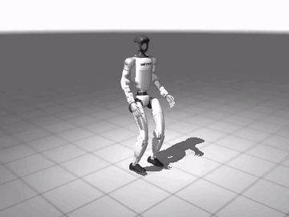

# humanoid-loco: Unitree G1 velocity-tracking locomotion, MJX and Isaac Lab training, CPU MuJoCo sim-to-sim evaluation

**Everything here is NVIDIA L4, simulation, no real robot.** Transfer between simulators is called
sim-to-sim (MJX to CPU MuJoCo). Nothing in this repository has been run on hardware.

<p align="center"></p>

**Live demo with all videos and result tables: [huggingface.co/spaces/pavanyadava07/humanoid-loco](https://huggingface.co/spaces/pavanyadava07/humanoid-loco)**

Videos in this repo: [PPO + DR in CPU MuJoCo](media/brax_dr_mujoco_cpu.mp4) |
[PPO + DR in MJX](media/brax_dr_mjx.mp4) | [no-DR ablation](media/brax_nodr_mujoco_cpu.mp4) |
[failed RSL-RL run](media/rsl_dr_mujoco_cpu.mp4) |
[Isaac Lab RSL-RL G1 in Isaac Sim](media/isaac_g1_flat.mp4)

What this project does:

1. Trains a joystick (velocity-command) walking policy for the Unitree G1 humanoid in
   [MuJoCo Playground](https://github.com/google-deepmind/mujoco_playground) (`G1JoystickFlatTerrain`, MJX on GPU)
   with brax PPO and the Playground default locomotion config, **with** the env's domain randomizer
   (floor friction, joint friction loss, armature, link masses, torso mass, joint offsets).
2. Trains the same task **without** domain randomization (same seed, same PPO config) as an ablation. Its wall-clock
   cap was shorter (75 min vs 125 min), so it reached fewer env steps; DR vs no-DR is therefore compared twice:
   final checkpoint vs final checkpoint, and step-matched (a snapshot of the DR run taken at the no-DR run's final step).
3. Trains the same task with **rsl-rl-lib PPO** through Playground's torch wrapper (`wrapper_torch.RSLRLBraxWrapper`),
   with a 72 min wall-clock cap.
4. Exports every actor to a static **ONNX** graph (opset 17) and checks action parity against the training framework.
5. Runs the ONNX policies closed-loop at the 50 Hz policy rate in **plain CPU MuJoCo** (`mujoco` Python bindings, not MJX)
   on the same G1 model, 500 seeded episodes per condition: nominal, floor friction x0.5 / x1.5, torso mass +/-3 kg,
   random pushes, 1 and 2 control-step action latency, training-level sensor noise, and a more accurate solver.
   Reports fall rate with Wilson 95% intervals, survival time and velocity-tracking error.
6. **Isaac Lab track:** installs NVIDIA Isaac Sim 4.5 + Isaac Lab v2.1.1 on the same host, trains Isaac Lab's registered
   Unitree G1 velocity task (`Isaac-Velocity-Flat-G1-v0`, and `Isaac-Velocity-Rough-G1-v0` as a second run) with RSL-RL PPO,
   exports the policy (TorchScript + ONNX), records a headless video and evaluates it under the same kinds of perturbations
   **within Isaac Sim (PhysX), not sim-to-sim**. Isaac to MuJoCo sim-to-sim was not attempted: the Isaac Lab G1 (with hands, different
   waist and arm joints) and the Menagerie G1 have no exact joint mapping. See [`docs/ISAAC_LAB.md`](docs/ISAAC_LAB.md).

## Headline results

<!-- RESULTS:BEGIN -->
_Generated from results/*.json by scripts/make_report.py. NVIDIA L4, simulation, no real robot._

| policy | checkpoint env steps | MJX+DR fall rate | CPU MuJoCo nominal fall rate [Wilson 95%] | nominal lin-vel err (m/s) | worst sim-to-sim condition (fall rate) |
|---|---|---|---|---|---|
| brax PPO + DR | 130,744,320 | 48.2% | 0.0% [0.0, 0.8] | 0.154 | action_delay_2steps (98.2%) |
| brax PPO + DR, step-matched | 75,694,080 | 67.7% | 0.8% [0.3, 2.0] | 0.251 | action_delay_2steps (100.0%) |
| brax PPO, no DR | 75,694,080 | 69.2% | 0.6% [0.2, 1.7] | 0.154 | action_delay_2steps (100.0%) |
| RSL-RL PPO + DR | 86,704,128 | 100.0% | 100.0% [99.2, 100.0] | 1.924 | nominal (100.0%) |

Isaac Lab track (within Isaac Sim (PhysX), not sim-to-sim):

| Isaac Lab policy | task | env steps | training wall clock | nominal fall rate [Wilson 95%] | nominal lin-vel err (m/s) | worst condition (fall rate) |
|---|---|---|---|---|---|---|
| RSL-RL PPO (g1_flat) | Isaac-Velocity-Flat-G1-v0 | 147,456,000 | 0h48m | 0.0% [0.0, 0.8] (n=500) | 0.121 | action_delay_2steps (95.4%) |
| RSL-RL PPO (g1_rough) | Isaac-Velocity-Rough-G1-v0 | 266,403,840 | 1h50m | 0.8% [0.3, 2.0] (n=500) | 0.108 | action_delay_2steps (86.4%) |
<!-- RESULTS:END -->

Qualitative summary (numbers in the table above and in docs/RESULTS.md): both brax policies walk and transfer to
CPU MuJoCo; at matched env steps the ablation's clearest paired differences (DR better) are under reduced floor
friction and one-step action latency, and the longer-trained final DR checkpoint is also better under pushes; two control steps of latency and the harsh push condition break every brax policy often; the RSL-RL run did not learn
to stand within its budget and is reported as a failed run.

Full tables (training curves, common MJX evaluation, parity checks, every sim-to-sim condition, paired DR vs no-DR
comparison, failures): [`docs/RESULTS.md`](docs/RESULTS.md). Both files are generated by `python scripts/make_report.py`
from `results/*.json`; no number is typed by hand.

## How the sim-to-sim evaluation is built

- `hloco/mj_env.py` rebuilds the 103-dim actor observation of `mujoco_playground/_src/locomotion/g1/joystick.py`
  from CPU MuJoCo state: pelvis local linear velocity and gyro, gravity in the pelvis IMU frame, command,
  joint positions (minus the `knees_bent` pose), joint velocities, previous action and gait phase.
  It reproduces two details of the upstream code: the previous-action slot holds the action from two control
  steps back at observation time, and the phase in the observation is the phase before the per-step increment.
- `tests/test_obs_parity.py` and `scripts/check_parity.py` feed identical states to MJX and CPU MuJoCo and compare
  the observation vector element-wise. The same script measures how far the two simulators drift apart in one
  control step from an identical state; that drift is the sim-to-sim gap the policy has to tolerate.
- Actions: motor target = `knees_bent` pose + 0.5 x action, position actuators, 10 physics substeps of 2 ms per
  20 ms control step, the same MJCF and the same solver options as the MJX model (condition `accurate_solver`
  switches to Newton with 100 iterations and the implicitfast integrator).
- Episode i uses seed 10000 + i in every condition and for every policy, so DR vs no-DR comparisons are paired.

## Reproduce

Requirements: Linux x86_64, an NVIDIA GPU with a CUDA 12 capable driver, `uv`, git. Numbers in this repo were
produced on one NVIDIA L4 (24 GB) shared with other processes.

```bash
bash scripts/setup_env.sh                 # uv venv (Python 3.10) + pinned requirements.txt + sparse Menagerie checkout
make train                                # brax PPO with DR, brax PPO without DR, RSL-RL PPO (see Makefile for budgets)
make eval                                 # ONNX export + parity, MJX common eval, CPU MuJoCo sim-to-sim (100 episodes/condition)
make render                               # media/*.mp4
make isaac-setup                          # separate .venv-isaac: Isaac Sim 4.5 wheels + Isaac Lab v2.1.1 (disk use in docs/ISAAC_LAB.md)
make isaac-train isaac-play isaac-eval    # Isaac Lab G1 flat: RSL-RL training, export + video, eval within Isaac Sim
make report                               # docs/RESULTS.md, docs/ISAAC_LAB.md, README table
make test && make lint                    # pytest (obs parity, ONNX parity, eval determinism) and ruff
```

Budgets are recorded inside each `results/train_*.json` (`requested_num_timesteps`, `final_step`, `wall_clock_s`,
`env_steps_per_s_steady`). Set `XLA_PYTHON_CLIENT_MEM_FRACTION` if the GPU is shared.

## Layout

```
hloco/           observation/actuation re-implementation for CPU MuJoCo, ONNX builder, param export, stats
scripts/         train_brax.py, train_rsl_rl.py, export_onnx.py, eval_mjx.py, eval_sim2sim.py, check_parity.py,
                 render.py, isaac_lab_check.py, make_report.py, build_space.py, setup_env.sh
scripts/isaac/   setup_isaac.sh, train_g1.py, play_export.py, make_video.py, eval_g1.py, compare_models.py,
                 record_install.py (Isaac Lab track; run in .venv-isaac except make_video/compare/record)
tests/           obs parity (MJX vs MuJoCo), ONNX vs framework parity, eval determinism
results/         every measured number, as JSON with provenance (GPU, git revision, UTC time)
checkpoints/     final actor parameters (params.pkl / policy.pkl, model.pt) and policy.onnx per run
media/           rendered rollouts
docs/            RESULTS.md and ISAAC_LAB.md (generated)
```

## Limitations

- **No real robot.** Nothing was run on a physical G1; there is no sim-to-real claim of any kind.
- **Isaac Lab numbers are not a transfer test.** The Isaac-trained policy is evaluated inside Isaac Sim, the simulator it
  was trained in, on Isaac Lab's own G1 model (with hands; joint lists compared in docs/ISAAC_LAB.md), which differs from the
  Menagerie G1 used by the MuJoCo track. Fall definitions and command ranges also differ, so the two tracks' tables are not comparable
  row by row. Amazon Linux 2023 is not an Isaac Sim supported OS; the workarounds used are listed in docs/ISAAC_LAB.md.
- Sim-to-sim here means MJX (JAX implementation, float32) to CPU MuJoCo (float64) with the same MJCF. Both share
  the same simplified collision model (explicit contact pairs only: feet-floor, foot-foot, hand-thigh), actuator model and solver options, so passing this
  evaluation is not evidence about transfer to hardware.
- One seed per training configuration, each capped by wall clock on a shared GPU (DR 125 min, no-DR 75 min, RSL-RL
  72 min; the brax DR run finished its 130M-step budget before its cap). The Playground default budget for this task
  is 200M env steps; none of the runs reached it. Conclusions about DR vs no-DR and brax vs RSL-RL are single-run
  observations; the paired McNemar p-values in docs/RESULTS.md compare two checkpoints, not two algorithms.
- The CPU MuJoCo push condition (0.5 to 1.5 m/s base-velocity kicks every 2 to 4 s) is harsher than the training
  pushes (0.1 to 2.0 m/s every 5 to 10 s) on purpose.
- The torso-mass perturbation (+/-3 kg) is outside the +/-1 kg training randomization on purpose; friction x0.5 of the
  nominal 0.6 (0.3) is also below the 0.4 to 1.0 training range. Both test extrapolation.
- Rewards are only computed inside MJX; the CPU MuJoCo evaluation reports falls, survival time and tracking error.
- Commands in the CPU evaluation are held constant for the 20 s episode; in training they are resampled every 10 s.

## Credits

Environment, reward, domain randomizer and PPO configs: MuJoCo Playground (Apache-2.0) and brax.
Robot model: Unitree G1 from MuJoCo Menagerie. RSL-RL: rsl-rl-lib. This repository adds the training/eval
scripts, the CPU MuJoCo re-implementation of the policy interface, the ONNX export and the evaluation protocol.
